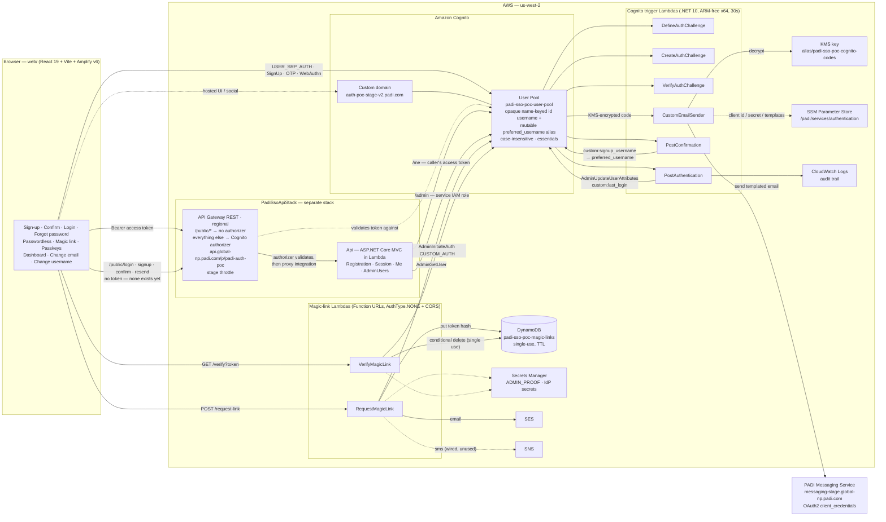
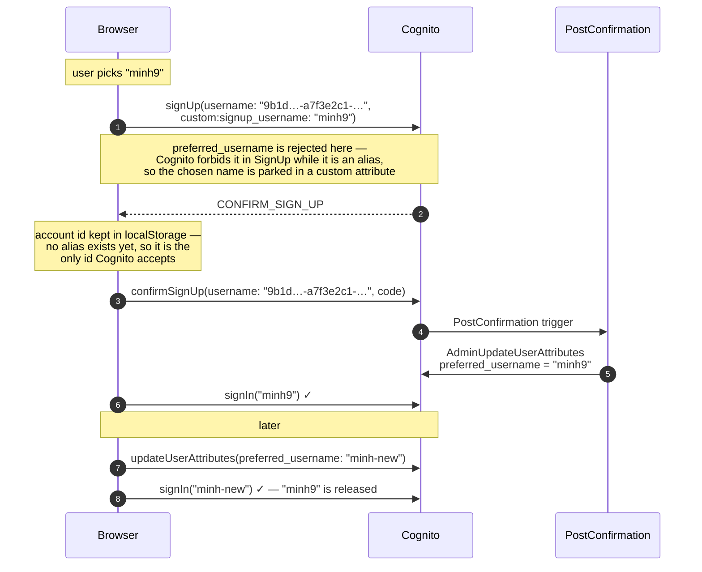
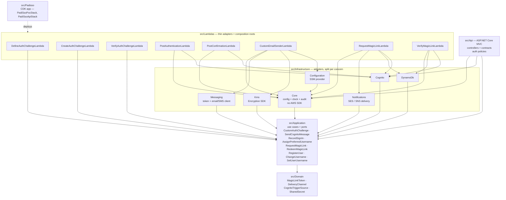
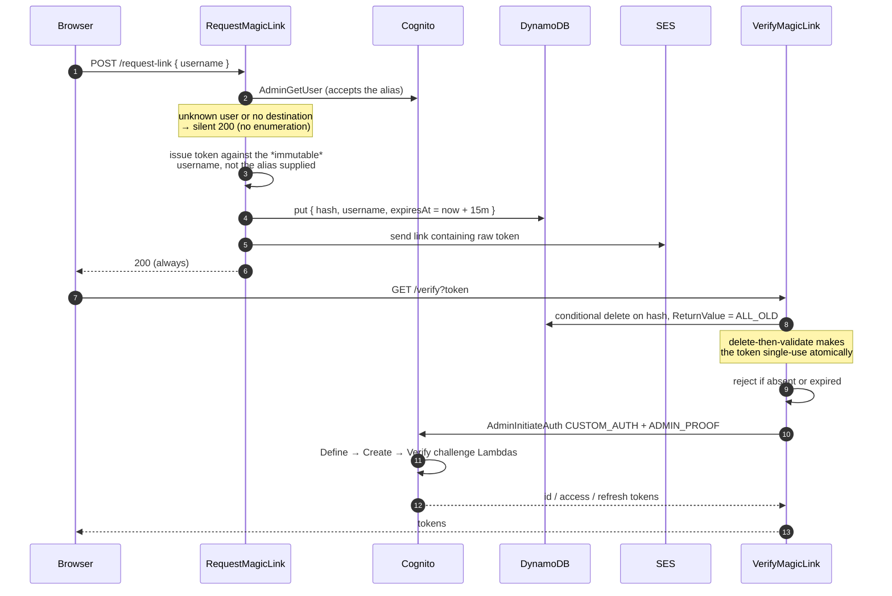
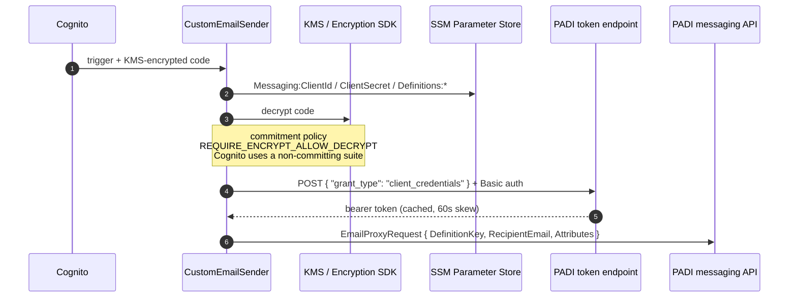
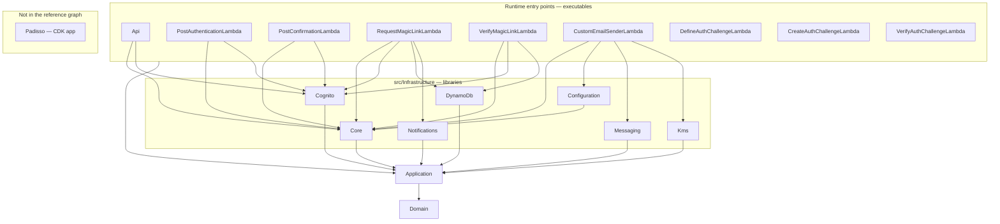

# PADISSO architecture

Six views of the same system: what runs in AWS, how identity is modelled, how the code is
layered, how the two non-obvious flows sequence, and the literal project reference graph.

Two CDK stacks: `PadiSsoPocStack` (the pool and its triggers) and `PadiSsoApiStack` (the
management API behind API Gateway). The API stack takes the pool by reference, so CDK orders
the deployments.

---

## 1. Deployed architecture



Dashed edges are configuration or not-yet-active paths. `CustomSMSSender` exists in code
but is not wired to the pool.

---

## 2. Identity model

Three identifiers, only one of which the user ever types. This is the part most likely to
be misread by someone new to the codebase.

| Identifier | Mutable | Who sees it | Role |
|---|---|---|---|
| `sub` | Never | Nobody | Cognito's internal id. Stable across everything |
| `username` | Never | Nobody | An opaque id minted at sign-up, `<name key>-<uuid>`. Cognito fixes it at creation |
| `preferred_username` | **Yes** | The user | The name they type to sign in. Unique pool-wide |
| `email` | Yes | The user | A plain attribute — **not** an alias, so not unique |

Cognito's `username` cannot be changed after a user is created, so it cannot be the name
anyone types. `preferred_username` is configured as an **alias attribute**, which makes it a
sign-in identifier the user can update.



The gap between sign-up and confirmation is the sharp edge: the account has no alias yet, so
the account id is the only identifier `confirmSignUp` and `resendSignUpCode` accept — and the
user has never seen it. `web/src/pending-signup.ts` holds it in `localStorage` so a reload or
a login-page redirect recovers.

The id's prefix is a hash of the chosen name (`AccountIdentifier`), which is what makes
`POST /public/signup/resend-by-username` possible from any browser: one `ListUsers` call
filtered on `username ^= "<key>-"`, then an exact `custom:signup_username` match. A lookup
that finds nothing still calls Cognito with the name, so the response is Cognito's simulated
one and does not reveal whether a sign-up is pending. Confirming on a different device is
still not possible — confirm takes the id — so there the user signs up again, and the chosen
name is still free because it never became an alias.

---

## 3. Code layers

Dependencies point inward only. Nothing in `Domain` or `Application` references an AWS SDK.

This view is conceptual and draws each Lambda's most significant edges. For the exact
`ProjectReference` graph, see [6. Project references](#6-project-references).



**Why infrastructure is split per concern rather than one project:** each Lambda pulls in
only the AWS SDKs it uses. The published bundle sizes show what that buys:

| Lambda | References | Size |
|---|---|---|
| `DefineAuthChallengeLambda` | `Application` only | 249 KB |
| `CreateAuthChallengeLambda` | `Application` only | 245 KB |
| `VerifyAuthChallengeLambda` | `Application` only | 245 KB |
| `PostAuthenticationLambda` | `+ Cognito`, `Core` | 5.0 MB |
| `PostConfirmationLambda` | `+ Cognito`, `Core` | 5.0 MB |
| `VerifyMagicLinkLambda` | `+ DynamoDb` | 7.5 MB |
| `RequestMagicLinkLambda` | `+ Notifications` | 9.4 MB |
| `CustomEmailSenderLambda` | `+ Configuration`, `Kms`, `Messaging` | 30 MB |

The three challenge triggers carry no AWS SDK at all. `Configuration` is separate from
`Core` precisely so the Systems Manager SDK reaches only `CustomEmailSenderLambda` — one bundle
out of eight. Collapsing infrastructure into a single project would push every function
toward that 30 MB.

---

## 4. Magic-link flow

The bespoke part — a custom auth flow driven server-side, so the browser never holds a
Cognito secret.



The three challenge Lambdas exist only to satisfy Cognito's custom-auth contract; the real
check already happened in `VerifyMagicLink`. `ADMIN_PROOF` is the shared secret that lets
them distinguish a server-initiated flow from a client-initiated one.

Storing the immutable username rather than the caller's input matters now that usernames are
mutable: a user who changes their name between requesting a link and clicking it would
otherwise hold a token pointing at an alias that no longer resolves.

---

## 5. Email delivery

Every Cognito-originated email — sign-up confirmation, password reset, passwordless OTP,
MFA — leaves through `CustomEmailSender`, not Cognito's built-in mailer.



There is **no fallback**: if the messaging call fails, sign-up, password reset and email OTP
all fail together. The trigger source name selects the template — `CustomEmailSender_SignUp`
becomes definition key `SignUp`, falling back to `Default` when that key is unset.

On `CustomEmailSender_UpdateUserAttribute` — the change-email flow — `userAttributes.email`
carries the user's **new** address, so the code reaches the address being verified rather
than the one still active for sign-in. Confirmed against the live pool.

---

## 6. Project references

The build graph of `src/Padisso.sln` — every `ProjectReference` in the 19 `.csproj` files,
and nothing inferred. Arrows point from the referencing project to the referenced one.



| Entry point | References |
|---|---|
| `Api`, `PostAuthenticationLambda`, `PostConfirmationLambda` | Application, Core, Cognito |
| `RequestMagicLinkLambda` | Application, Core, Cognito, DynamoDb, Notifications |
| `VerifyMagicLinkLambda` | Application, Core, Cognito, DynamoDb |
| `CustomEmailSenderLambda` | Application, Core, Configuration, Messaging, Kms |
| `DefineAuthChallengeLambda`, `CreateAuthChallengeLambda`, `VerifyAuthChallengeLambda` | Application |
| `Padisso` | *(none)* |

What the graph shows:

- **`Padisso` has no project references** — only `Amazon.CDK.Lib` and `Constructs`. It is
  coupled to the rest of the solution by *path*, pointing at the bundles
  `publish-lambdas.ps1` produces. `dotnet build` therefore cannot catch a handler string
  that names the wrong assembly, or a stale bundle: those surface at deploy or cold start.
  Always publish before `cdk deploy`.
- **Every entry point references `Application` directly**, not only through an adapter. The
  three challenge triggers reference nothing else.
- **No adapter is referenced by `Application` or `Domain`.** The inward dependency rule holds
  structurally, with no analyzer needed to enforce it.
- **`Configuration` → `Core` is the only edge inside the infrastructure tier**, and
  `Configuration` is the one adapter that does not reference `Application` directly.
- **Several adapters have a single consumer**: `Configuration`, `Messaging` and `Kms` serve
  only `CustomEmailSenderLambda`; `Notifications` only `RequestMagicLinkLambda`; `DynamoDb` only the two
  magic-link Lambdas. `Domain`'s only direct consumer is `Application` — everything else
  reaches `UsernameRules` and `BirthdateRules` transitively.
- In the solution file, only `Lambdas` and `Infrastructure` are solution folders; `Padisso`,
  `Api`, `Application` and `Domain` sit at the root.

To regenerate the edge list after adding a project:

```bash
grep -rn "ProjectReference Include" src --include=*.csproj
```
