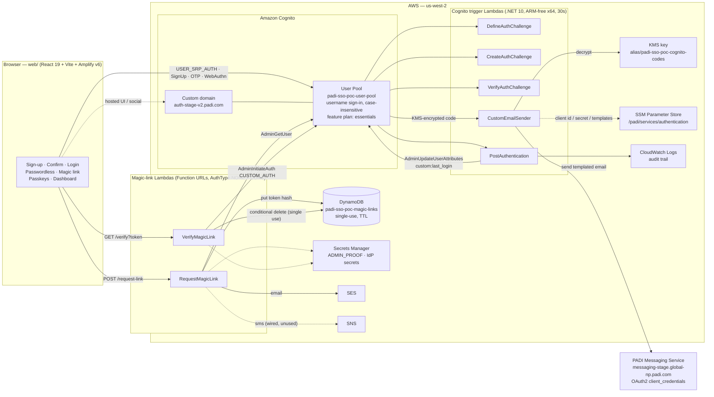
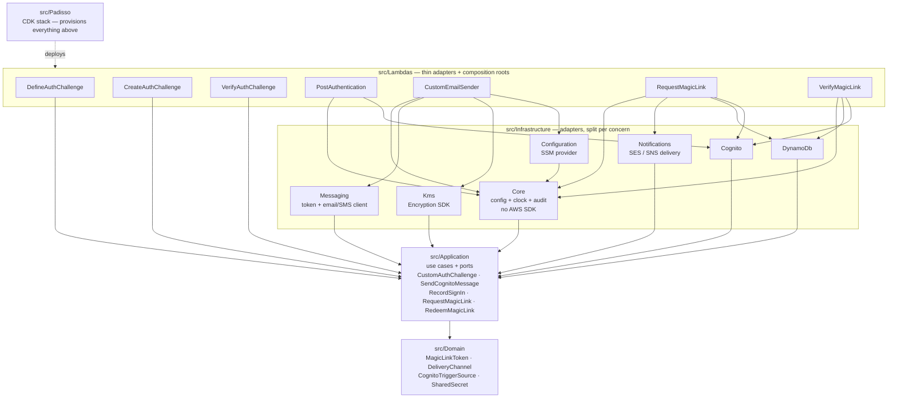
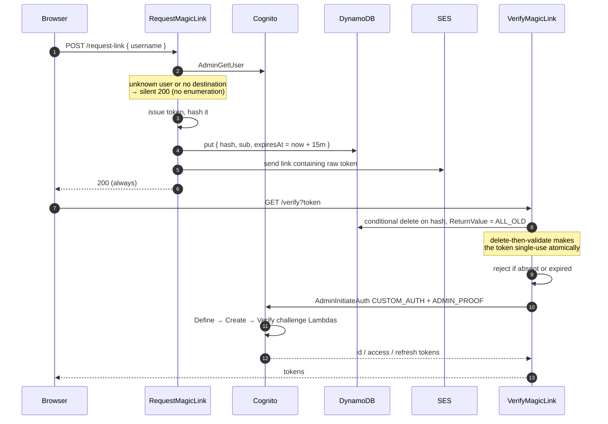
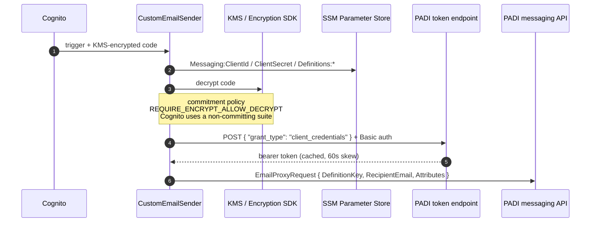

# PADISSO architecture

Three views of the same system: what runs in AWS, how the code is layered, and how the
two non-obvious flows actually sequence.

---

## 1. Deployed architecture

Dashed edges are configuration or not-yet-active paths. `CustomSMSSender` exists in code
but is not wired to the pool.

---

## 2. Code layers

Dependencies point inward only. Nothing in `Domain` or `Application` references an AWS SDK.

**Why infrastructure is split per concern rather than one project:** each Lambda pulls in
only the AWS SDKs it uses. `DefineAuthChallenge`, `CreateAuthChallenge` and
`VerifyAuthChallenge` reference `Application` alone and carry no SDK at all;
`PostAuthentication` takes `Infrastructure.Cognito` but not `Configuration`, so the Systems
Manager SDK stays out of five of the seven bundles. Merging these projects would add tens of
megabytes to every function.

---

## 3. Magic-link flow

The bespoke part — a custom auth flow driven server-side, so the browser never holds a
Cognito secret.

The three challenge Lambdas exist only to satisfy Cognito's custom-auth contract; the real
check already happened in `VerifyMagicLink`. `ADMIN_PROOF` is the shared secret that lets
them distinguish a server-initiated flow from a client-initiated one.

---

## 4. Email delivery

Every Cognito-originated email — sign-up confirmation, password reset, passwordless OTP,
MFA — leaves through `CustomEmailSender`, not Cognito's built-in mailer.

There is **no fallback**: if the messaging call fails, sign-up, password reset and email OTP
all fail together. The trigger source name selects the template — `CustomEmailSender_SignUp`
becomes definition key `SignUp`.
